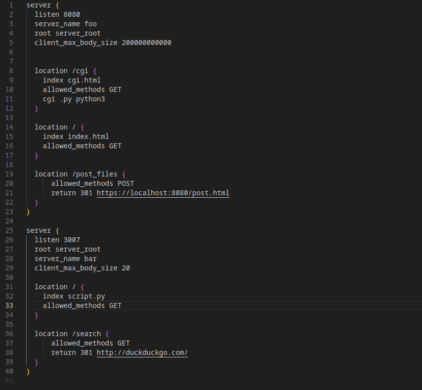

<h1 align="center"> 
	WebServer 
</h1>

	O WebServer tem o intuito de servir e gerenciar chamadas HTTP, muito parecido com o funcionamento do Nginx

Indice
=================
<!--ts-->
   * [Sobre](#Sobre)
   * [Instalação](#instalacao)
   * [Como usar](#como-usar)
      * [Como interpretar os arquivo](#Como-interpretar-os-arquivo)
   * [Tests](#testes)
<!--te-->

<h4 align="center"> 
	Status: ✅ Finalizado ✅
</h4>

## Sobre 
 - WebServer é um projeto da escole 42, o desafio é fazer um servidor web que gerencia chamdas HTML e serve o conteudo de um site para um cliente somente utilizando a biblioteca padrão do C++ ou seja nenhuma tecnologia ou biblioteca externa é utilizada, fazendo assim a necessidade de lidar com a interpretaçao do que o cliente quer, lidar com o arquivo de configuraçao do servidor, fazer um gerenciamento com o poll dos FDin(html do cliente) e FDout(resposta do servidor), lidar com problemas de requisiçoes dos clientes e dar uma codigo de status coerente, dar um minimo suporte a CGI dentre outras coisas.

## Instalacao
 - Basta ter o c++98 na sua maquina que tudo deve rodar bem.

## Como usar
 - faça o git clone e entre na pasta raiz, rode no terminal 'make' assim que tudo estiver compilado basta rodar no terminal './webserver arquivo.conf' 3 arquivos de exemplo são dados default, example1 e example2
	## Como interpretar os arquivo
	 - Este é o arquivo default.conf vamos examinalo e mostrarei como ele funciona 
	 
	 Bem cada server é divido por '{}' e cada servidor serve a uma porta especifica simbolizada por 
	 
	 'listen' nesse exemplo 8080 ou 3007

	 'server_name foo' simboliza nosso host o que digitamos na barra de endereço (como tudo está em loop back você nao sera capas de digitar foo e acabar no site a não ser que você mude um arquivo do linux que redirecionaria foo para o endereço 127.0.0.1)

	 'root server_root' 'root' indica para meu servidor que a pasta root ou '/' do meu servidor é 'server_root'

	 'client_max_body_size 200000000000' Indica o tamanho maximo o corpo da mensagem pode ter

	 'location' locations são pastas dentro do meu root que também são dividas por '{}' pois dentro de cada location configuraçoes espeficicas podem ser dadas como:

	 'index' que indica o arquivo que deve ser mandado caso o usuario entre em naquela 'location' como /cgi que dara o arquivo 'cgi.html' ou a pasta raiz '/' que data o arquivo 'index.html'

	 'allowed_methods' indica os metodos permitidos naquela localizaçao especifica os metodos suportados são GET, POST e DELETE

	 'cgi' indica que aquela location suporta a execução de algum tipo de CGI que é simbolizada pelo formatod o arquivo ex:'.py' e o comando que precisa ser dado par a executalo no servidor ex:'python3'

	 'return' faz um redirecionamento caso o usuario entre na location especifica

## Testes 
 - Bem dado o contexto dos arquivos você pode brincar o quanto quiser, mudando os arquivos vendo paginas de erro (tem gifs bem engraçados juro) e fazer oque quiser, alem do proprio site testar algumas coisas basta ir seguindo as coisas do site divirtasse
 